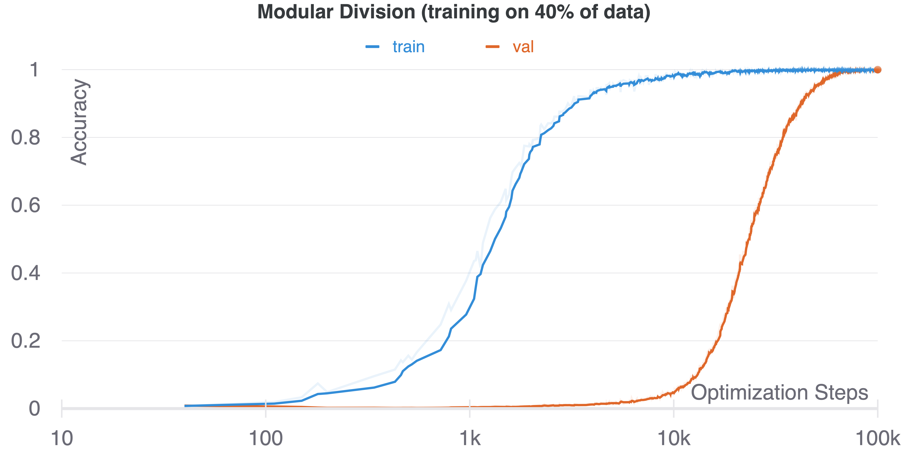

## GROKKING: GENERALIZATION BEYOND OVERFITTING ON SMALL ALGORITHMIC DATASETS
### unofficial re-implementation of [this paper](https://mathai-iclr.github.io/papers/papers/MATHAI_29_paper.pdf) by Power et al.
### code written by Charlie Snell

pull and install:
```
git clone https://github.com/Sea-Snell/grokking.git
cd grokking/
pip install -r requirements.txt
```

To roughly re-create Figure 1 in the paper run:

```
export PYTHONPATH=$(pwd)/grokk_replica/
cd scripts/
python train_grokk.py
```


###### Running the above command should give curves like this.

Try different operations or learning / architectural hparams by modifying configurations in the `config/` directory. I use [Hydra](https://hydra.cc/docs/intro) to handle the configs (see their documentation to learn how to change configs in the commandline etc...).

Training uses [Weights And Biases](https://wandb.ai/home) by default to generate plots in realtime. If you would not like to use wandb, just set `wandb.use_wandb=False` in `config/train_grokk.yaml` or as an argument when calling `train_grokk.py`
